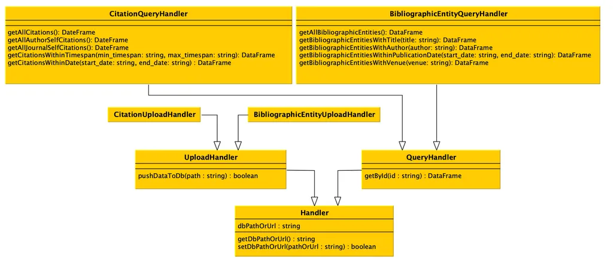
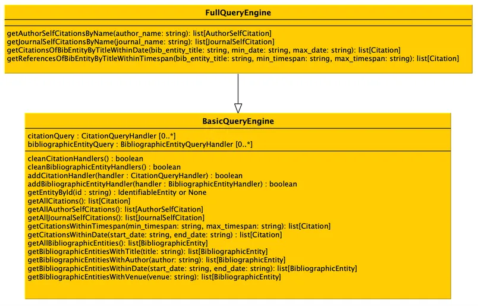
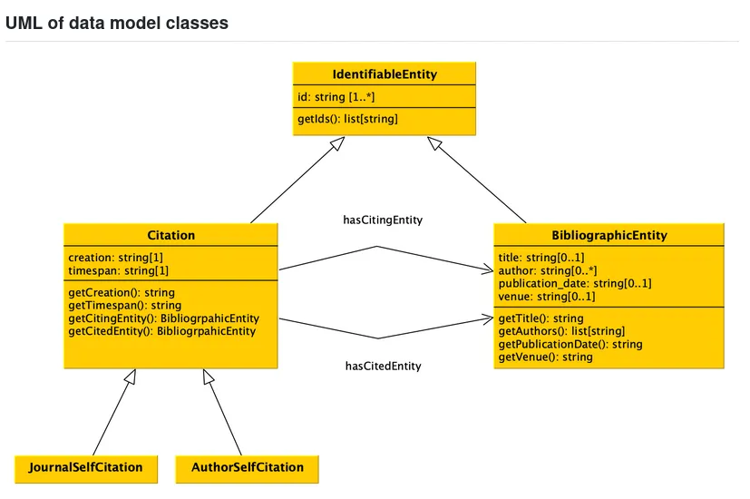

# comp-data_group-project

This is an implementation of the [project](https://github.com/comp-data/2025-2026/tree/main/docs/project) for the 2025-2026 [Computational Management of Data](https://github.com/comp-data/2025-2026) course at the [University of Bologna](https://unibo.it).


# Working on Github


Hi all, I set up the github repo to collaborate on the comp-data group project.

We can work on separate files on separate machines, then push the changes on this repository.

## Set up the repository locally by cloning the repo

```bash
git clone https://github.com/amirdjalali/comp-data_group-project.git
cd your-repo
```

## Set your identity (first-time Git users)

```bash
git config --global user.name "Your Name"
git config --global user.email "you@email.com"
```

## How to make changes

Always pull latest changes first. ```pull``` synchronizes all the changes locally.

```bash
git pull origin main
```
Make changes, then stage and commit. Commit saves changes on your local machine.

```bash
# tell git which files have changed. To include all files, use
git add .

# commit saves the changes on your local git repo, with a description of the changes
git commit -m "Add: description of what you did"
```

Push your changes. Uploads changes to github so everyone can see them.

```bash
git push origin main
```

Then open a Pull Request (PR) on GitHub so teammates can review before merging into main.

# Good Collaboration Habits

- Pull before you push — always sync with main before starting work.
- Write clear commit messages — explain what and why
- Use Issues — track bugs and features via GitHub Issues
- Communicate in PRs — leave comments and request specific reviewers

# Quick Reference: Daily Workflow

```bash
# Start of every work session — always pull first!
git pull origin main

# Do your work on your files...

# Save and push
git add .
git commit -m "Brief description of what you changed"
git push origin main
```


# How to organize files and folders



I asked Claude how to structure the classes in files. Based on the UML, here's how I'd structure it:

```
handlers/
├── __init__.py
├── handler.py                              # Handler (base)
├── upload_handler.py                       # UploadHandler
├── query_handler.py                        # QueryHandler
├── citation_upload_handler.py              # CitationUploadHandler
├── bibliographic_entity_upload_handler.py  # BibliographicEntityUploadHandler
├── citation_query_handler.py               # CitationQueryHandler
└── bibliographic_entity_query_handler.py   # BibliographicEntityQueryHandler
```

The hierarchy mirrors the UML inheritance:

```
Handler
├── UploadHandler
│   ├── CitationUploadHandler
│   └── BibliographicEntityUploadHandler
└── QueryHandler
    ├── CitationQueryHandler
    └── BibliographicEntityQueryHandler
```

One class per file is the standard Python convention for class hierarchies like this. Each file imports its parent, e.g.:
python

```python
# citation_query_handler.py
from .query_handler import QueryHandler

class CitationQueryHandler(QueryHandler):
    ...
```

```python
# handlers/__init__.py  — re-export everything for clean imports
from .handler import Handler
from .upload_handler import UploadHandler
from .query_handler import QueryHandler
from .citation_query_handler import CitationQueryHandler
# etc.
```

Then elsewhere in your code you can just do:

```python
from handlers import CitationQueryHandler
```

[def]: handler.png



Based on the UML, here's the full structure combining both diagrams:

```
project/
├── handlers/
│   ├── __init__.py
│   ├── handler.py
│   ├── upload_handler.py
│   ├── query_handler.py
│   ├── citation_upload_handler.py
│   ├── bibliographic_entity_upload_handler.py
│   ├── citation_query_handler.py
│   └── bibliographic_entity_query_handler.py
├── engines/
│   ├── __init__.py
│   ├── basic_query_engine.py
│   └── full_query_engine.py
├── tests/
│   └── __init__.py
└── pyproject.toml
```

The ```engines/``` folder is separate from ```handlers/``` because they're a distinct layer — engines use handlers (via ```citationQuery``` and ```bibliographicEntityQuery``` attributes), they don't inherit from them.

The import flow would be:

```
handler.py
    ↑
upload_handler.py / query_handler.py
    ↑
citation_query_handler.py / etc.
    ↑
basic_query_engine.py
    ↑
full_query_engine.py
```



Add a model/ folder for these:

```
project/
├── model/
│   ├── __init__.py
│   ├── identifiable_entity.py
│   ├── bibliographic_entity.py
│   ├── citation.py
│   ├── journal_self_citation.py
│   └── author_self_citation.py
├── handlers/
│   └── ...
├── engines/
│   └── ...
├── tests/
│   └── __init__.py
└── pyproject.toml
```

Inheritance mirrors the UML:

```
IdentifiableEntity
├── BibliographicEntity
└── Citation
    ├── JournalSelfCitation
    └── AuthorSelfCitation
```

```Citation``` also holds references to two ```BibliographicEntity``` instances (```getCitingEntity``` and ```getCitedEntity```), so ```citation.py``` will need to import from ```bibliographic_entity.py```.

The general rule of thumb: separate folders for separate concerns — data models don't belong mixed in with handlers or engines.


# What is ```__init__.py```?

It's a special file that marks a directory as a Python package (i.e. importable module), and optionally controls what gets exported from it.

Without it, Python won't recognize the folder as a package and imports will fail.

Two common uses:

Just mark the folder as a package — leave it empty:

```python

# __init__.py (empty)
```

Re-export things for cleaner imports:

```python
# handlers/__init__.py
from .citation_query_handler import CitationQueryHandler
from .query_handler import QueryHandler
```

This lets you write:

```python
from handlers import CitationQueryHandler  # clean ✅
```

Instead of:

```python
from handlers.citation_query_handler import CitationQueryHandler  # verbose ❌
```

One gotcha with uv/modern Python: if your pyproject.toml uses src/ layout, make sure you also have an __init__.py inside src/handlers/, not just src/.

For your project I'd start with empty __init__.py files and only add re-exports once the structure stabilizes — it's easier to maintain that way.